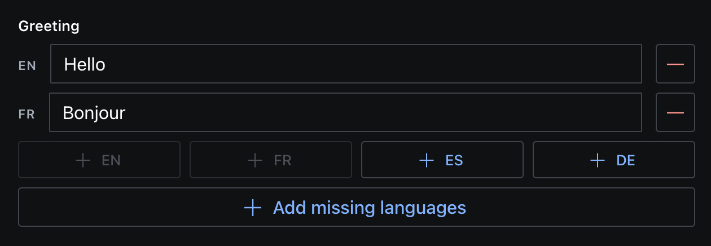

> This is the **Sanity Studio v3 version** of sanity-plugin-internationalized-array.
>
> For the v2 version, please refer to the [v2-branch](https://github.com/SimeonGriggs/sanity-plugin-internationalized-array/tree/studio-v2).

# sanity-plugin-internationalized-array

A helper function that renders a custom input component for writing localized fields of content into an array.



## Installation

```
npm install --save sanity-plugin-internationalized-array
```

or

```
yarn add sanity-plugin-internationalized-array
```

## Usage (simple)

Add it as a plugin in sanity.config.ts (or .js):

```ts
import {defineConfig} from 'sanity'
import {internationalizedArray} from 'sanity-plugin-internationalized-array'

 export const defineConfig({
  // ...
  plugins: [
    internationalizedArray({
      languages: [
        {id: 'en', title: 'English'},
        {id: 'fr', title: 'French'}
      ],
      fieldTypes: ['string'],
    })
  ]
})
```

This will register two new fields to the schema, based on the settings passed into `fieldTypes`:

- `internationalizedArrayString` an array field of:
- `internationalizedArrayStringValue` an object field, with a single `string` field inside called `value`

You can pass in more registered schema-type names to generate more internationalized arrays. Use them in your schema like this:

```ts
defineField({
  name: 'greeting',
  type: 'internationalizedArrayString',
}),
```

## Usage (advanced)

For more control over the `value` field, you can pass a schema definition into the `fieldTypes` array.

```ts
import {defineConfig} from 'sanity'
import {internationalizedArray} from 'sanity-plugin-internationalized-array'

 export const defineConfig({
  // ...
  plugins: [
    internationalizedArray({
      languages: [
        {id: 'en', title: 'English'},
        {id: 'fr', title: 'French'}
      ],
      fieldTypes: [
        defineField({
          name: 'featuredProduct',
          type: 'reference',
          to: [{type: 'product'}]
          hidden: (({document}) => !document?.title)
        })
      ],
    })
  ]
})
```

This would also create two new fields in your schema.

- `internationalizedArrayFeaturedProduct` an array field of:
- `internationalizedArrayFeaturedProductValue` an object field, with a single `string` field inside called `value`

Note that the `name` key in the field gets rewritten to `value` and is instead used to name the object field.

## Shape of stored data

The custom input contains buttons which will add new array items with the language as the `_key` value. Data returned from this array will look like this:

```json
"greeting": [
  { "_key": "en", "value": "hello" },
  { "_key": "fr", "value": "bonjour" },
]
```

## Querying data

Using GROQ filters you can query for a specific language key like so:

```js
*[_type == "person"] {
  "greeting": greeting[_key == "en"][0].value
}
```

## Migrate from objects to arrays

[See the migration script](https://github.com/SimeonGriggs/sanity-plugin-internationalized-array/blob/main/migrations/transformObjectToArray.js) inside `./migrations/transformObjectToArray.js` of this Repo.

Follow the instructions inside the script and set the `_type` and field name you wish to target.

Please take a backup first!

### Why store localized field data like this?

The most popular way to store field-level translated content is in an object using the method prescribed in [@sanity/language-filter](https://www.npmjs.com/package/@sanity/language-filter). This works well and creates tidy object structures, but also create a unique field path for every unique field name, multiplied by the number of languages in your dataset.

For most people, this won't become an issue. On a very large dataset with a lot of languages, the [Attribute Limit](https://www.sanity.io/docs/attribute-limit) can become a concern. This plugin's arrays will use less attributes than an object once you have more than three languages.

The same content as above, plus a third language, structed as an `object` of `string` fields looks like this:

```json
"greeting" {
  "en": "hello",
  "fr": "bonjour",
  "es": "hola"
}
```

Which creates four unique query paths, one for the object and one for each language.

```
greeting
greeting.en
greeting.fr
greeting.es
```

Every language you add to every object that uses this structure will add to the number of unique query paths.

The array created by this plugin creates four query paths by default, but is not effected by the number of languages:

```
greeting
greeting[]
greeting[]._key
greeting[].value
```

By using this plugin you can safely extend the number of languages without adding any additional query paths.

MIT © Simeon Griggs
See LICENSE

## License

MIT-licensed. See LICENSE.

## Develop & test

This plugin uses [@sanity/plugin-kit](https://github.com/sanity-io/plugin-kit)
with default configuration for build & watch scripts.

See [Testing a plugin in Sanity Studio](https://github.com/sanity-io/plugin-kit#testing-a-plugin-in-sanity-studio)
on how to run this plugin with hotreload in the studio.

### Release new version

Run ["CI & Release" workflow](https://github.com/SimeonGriggs/sanity-plugin-internationalized-array/actions/workflows/main.yml).
Make sure to select the main branch and check "Release new version".

Semantic release will only release on configured branches, so it is safe to run release on any branch.

## License

[MIT](LICENSE) © Simeon Griggs
