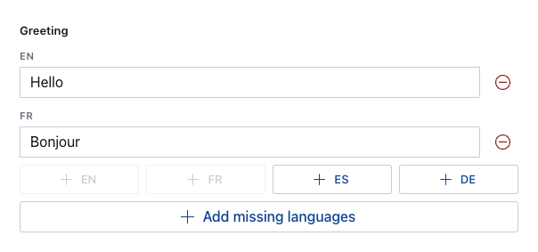

> This is the **Sanity Studio v3 version** of sanity-plugin-internationalized-array.
>
> For the v2 version, please refer to the [v2-branch](https://github.com/sanity-io/sanity-plugin-internationalized-array/tree/studio-v2).

# sanity-plugin-internationalized-array

A plugin to register array fields with a custom input component to store field values in multiple languages, queryable by using the language ID as an array `_key`.



- [sanity-plugin-internationalized-array](#sanity-plugin-internationalized-array)
  - [Installation](#installation)
  - [Usage for simple field types](#usage-for-simple-field-types)
  - [Loading languages](#loading-languages)
  - [Configuring the "Add translation" buttons](#configuring-the-add-translation-buttons)
  - [Using complex field configurations](#using-complex-field-configurations)
  - [Creating internationalized objects](#creating-internationalized-objects)
  - [Validation of individual array items](#validation-of-individual-array-items)
  - [Usage with @sanity/language-filter](#usage-with-sanitylanguage-filter)
  - [Shape of stored data](#shape-of-stored-data)
  - [Querying data](#querying-data)
  - [Migrate from objects to arrays](#migrate-from-objects-to-arrays)
    - [Why store localized field data like this?](#why-store-localized-field-data-like-this)
  - [License](#license)
  - [Develop \& test](#develop--test)
    - [Release new version](#release-new-version)
  - [License](#license-1)

## Installation

```
npm install --save sanity-plugin-internationalized-array
```

or

```
yarn add sanity-plugin-internationalized-array
```

## Usage for simple field types

Add it as a plugin in sanity.config.ts (or .js):

```ts
import {defineConfig} from 'sanity'
import {internationalizedArray} from 'sanity-plugin-internationalized-array'

 export const defineConfig({
  // ...
  plugins: [
    internationalizedArray({
      languages: [
        {id: 'en', title: 'English'},
        {id: 'fr', title: 'French'}
      ],
      defaultLanguages: ['en'],
      fieldTypes: ['string'],
    })
  ]
})
```

This will register two new fields to the schema, based on the settings passed into `fieldTypes`:

- `internationalizedArrayString` an array field of:
- `internationalizedArrayStringValue` an object field, with a single `string` field inside called `value`

The above config will also create an empty array item in new documents for each language in `defaultLanguages`. This is configured globally for all internationalized array fields.

You can pass in more registered schema-type names to generate more internationalized arrays. Use them in your schema like this:

```ts
// For example, in postType.ts

fields: [
  defineField({
    name: 'greeting',
    type: 'internationalizedArrayString',
  }),
]
```

## Loading languages

Languages must be an array of objects with an `id` and `title`.

```ts
languages: [
  {id: 'en', title: 'English'},
  {id: 'fr', title: 'French'}
],
```

Or an asynchronous function that returns an array of objects with an `id` and `title`.

```ts
languages: async () => {
  const response = await fetch('https://example.com/languages')
  return response.json()
}
```

The async function contains a configured Sanity Client in the first parameter, allowing you to store Language options as documents. Your query should return an array of objects with an `id` and `title`.

```ts
languages: async (client) => {
  const response = await client.fetch(`*[_type == "language"]{ id, title }`)
  return response
},
```

Additionally, you can "pick" fields from a document, to pass into the query. For example, if you have a concept of "Markets" where only certain language fields are required in certain markets.

In this example, each language document has an array of strings called `markets` to declare where that language can be used. And the document being authored has a single `market` field.

```ts
select: {
  market: 'market'
},
languages: async (client, {market = ``}) => {
  const response = await client.fetch(
    `*[_type == "language" && $market in markets]{ id, title }`,
    {market}
  )
  return response
},
```

## Configuring the "Add translation" buttons

The "Add translation" buttons can be positioned in one or multiple locations by configuring `buttonLocations`:

- `field` (default) Below the internationalized array field
- `unstable__fieldAction` Inside a Field Action (currently unstable)
- `document` Above the document fields, these buttons will add a new language item to every internationalized array field that can be found at the **root of the document**. Nested internationalized arrays are not yet supported.

To control the "Add translation" button titles, configure `languageDisplay`. This also affects language field labels.

- `codeOnly` (default) Shows only the language codes (id)
- `titleOnly` Shows the language title
- `titleAndCode` Shows the language title with the code in parentheses

The "Add all languages" button can be hidden with `buttonAddAll`.

```ts
import {defineConfig} from 'sanity'
import {internationalizedArray} from 'sanity-plugin-internationalized-array'

 export const defineConfig({
  // ...
  plugins: [
    internationalizedArray({
      // ...other config
      buttonLocations: ['field', 'unstable__fieldAction', 'document'], // default ['field']
      buttonAddAll: false, // default true
      languageDisplay: 'codeOnly' // codeOnly (default) | titleOnly | titleAndCode
    })
  ]
})
```

## Using complex field configurations

For more control over the `value` field, you can pass a schema definition into the `fieldTypes` array.

```ts
import {defineConfig} from 'sanity'
import {internationalizedArray} from 'sanity-plugin-internationalized-array'

 export const defineConfig({
  // ...
  plugins: [
    internationalizedArray({
      languages: [
        {id: 'en', title: 'English'},
        {id: 'fr', title: 'French'}
      ],
      fieldTypes: [
        defineField({
          name: 'featuredProduct',
          type: 'reference',
          to: [{type: 'product'}]
          hidden: (({document}) => !document?.title)
        })
      ],
    })
  ]
})
```

This would also create two new fields in your schema.

- `internationalizedArrayFeaturedProduct` an array field of:
- `internationalizedArrayFeaturedProductValue` an object field, with a single `string` field inside called `value`

Note that the `name` key in the field gets rewritten to `value` and is instead used to name the object field.

## Creating internationalized objects

Due to how fields are created, you cannot use anonymous objects in the `fieldTypes` array. You must register the object type in your Studio's schema as an "alias type".

```ts
// ./schemas/seoType.ts

import {defineField} from 'sanity'

export const seoType = defineField({
  name: 'seo',
  title: 'SEO',
  type: 'object',
  fields: [
    defineField({name: 'title', type: 'string'}),
    defineField({name: 'description', type: 'string'}),
  ],
})
```

Then in your plugin configuration settings, add the name of your alias type to the `fieldTypes` setting.

```ts
internationalizedArray({
  languages: [
    //...languages
  ],
  fieldTypes: ['seo'],
})
```

Lastly, add the field to your schema.

```ts
// ./schemas/post.ts

import {defineField, defineType} from 'sanity'

export default defineType({
  name: 'post',
  title: 'Post',
  type: 'document',
  fields: [
    defineField({
      name: 'seo',
      type: 'internationalizedArraySeo',
    }),
  ],
})
```

## Validation of individual array items

You may wish to validate individual language fields for various reasons. From the internationalized array field, add a validation rule that can look through all the array items, and return item-specific validation messages at the path of that array item.

```ts
defineField({
  name: 'title',
  type: 'internationalizedArrayString',
  description: `Use fewer than 5 words.`,
  validation: (rule) =>
    rule.custom<{value: string; _type: string; _key: string}[]>((value) => {
      if (!value) {
        return 'Title is required'
      }

      const invalidItems = value.filter(
        (item) => item.value.split(' ').length > 5,
      )

      if (invalidItems.length) {
        return invalidItems.map((item) => ({
          message: `Title is too long. Must be 5 words or fewer.`,
          path: [{_key: item._key}, 'value'],
        }))
      }

      return true
    }),
}),
```

## Usage with @sanity/language-filter

If you have many languages and authors that predominately write in only a few, [@sanity/language-filter](https://github.com/sanity-io/language-filter) can be used to reduce the number of language fields shown in the document form.


Configure both plugins in your sanity.config.ts file:

```ts
// ./sanity.config.ts

import {defineConfig, isKeySegment} from 'sanity'
import {languageFilter} from '@sanity/language-filter'

export default defineConfig({
  // ... other config
  plugins: [
    // ... other plugins
    languageFilter({
      // Use the same languages as the internationalized array plugin
      supportedLanguages: SUPPORTED_LANGUAGES,
      defaultLanguages: [],
      documentTypes: ['post'],
      filterField: (enclosingType, member, selectedLanguageIds) => {
        // Filter internationalized arrays
        if (
          enclosingType.jsonType === 'object' &&
          enclosingType.name.startsWith('internationalizedArray') &&
          'kind' in member
        ) {
          // Get last two segments of the field's path
          const pathEnd = member.field.path.slice(-2)
          // If the second-last segment is a _key, and the last segment is `value`,
          // It's an internationalized array value
          // And the array _key is the language of the field
          const language =
            pathEnd[1] === 'value' && isKeySegment(pathEnd[0])
              ? pathEnd[0]._key
              : null

          return language ? selectedLanguageIds.includes(language) : false
        }

        // Filter internationalized objects if you have them
        // `localeString` must be registered as a custom schema type
        if (
          enclosingType.jsonType === 'object' &&
          enclosingType.name.startsWith('locale')
        ) {
          return selectedLanguageIds.includes(member.name)
        }

        return true
      },
    }),
  ],
})
```

## Shape of stored data

The custom input contains buttons which will add new array items with the language as the `_key` value. Data returned from this array will look like this:

```json
"greeting": [
  { "_key": "en", "value": "hello" },
  { "_key": "fr", "value": "bonjour" },
]
```

## Querying data

Using GROQ filters you can query for a specific language key like so:

```js
*[_type == "person"] {
  "greeting": greeting[_key == "en"][0].value
}
```

## Migrate from objects to arrays

[See the migration script](https://github.com/sanity-io/sanity-plugin-internationalized-array/blob/main/migrations/transformObjectToArray.ts) inside `./migrations/transformObjectToArray.ts` of this Repo.

Follow the instructions inside the script and set the `_type` and field name you wish to target.

Please take a backup first!

### Why store localized field data like this?

The most popular way to store field-level translated content is in an object using the method prescribed in [@sanity/language-filter](https://www.npmjs.com/package/@sanity/language-filter). This works well and creates tidy object structures, but also creates a unique field path for every unique field name, multiplied by the number of languages in your dataset.

For most people, this won't become an issue. On a very large dataset with a lot of languages, the [Attribute Limit](https://www.sanity.io/docs/attribute-limit) can become a concern. This plugin's arrays will use fewer attributes than an object once you have more than three languages.

The same content as above, plus a third language, structured as an `object` of `string` fields looks like this:

```json
"greeting" {
  "en": "hello",
  "fr": "bonjour",
  "es": "hola"
}
```

Which creates four unique query paths, one for the object and one for each language.

```
greeting
greeting.en
greeting.fr
greeting.es
```

Every language you add to every object that uses this structure will add to the number of unique query paths.

The array created by this plugin creates four query paths by default, but is not affected by the number of languages:

```
greeting
greeting[]
greeting[]._key
greeting[].value
```

By using this plugin you can safely extend the number of languages without adding any additional query paths.

MIT © Sanity.io
See LICENSE

## License

MIT-licensed. See LICENSE.

## Develop & test

This plugin uses [@sanity/plugin-kit](https://github.com/sanity-io/plugin-kit)
with default configuration for build & watch scripts.

See [Testing a plugin in Sanity Studio](https://github.com/sanity-io/plugin-kit#testing-a-plugin-in-sanity-studio)
on how to run this plugin with hotreload in the studio.

### Release new version

Run ["CI & Release" workflow](https://github.com/sanity-io/sanity-plugin-internationalized-array/actions/workflows/main.yml).
Make sure to select the main branch and check "Release new version".

Semantic release will only release on configured branches, so it is safe to run release on any branch.

## License

[MIT](LICENSE) © Simeon Griggs
